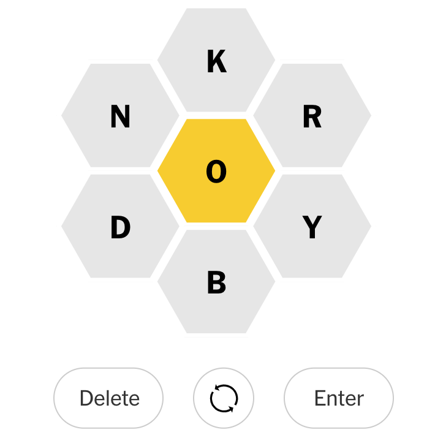

# Spelling bee solution

This is a short program to solve NYT's spelling bee.

It is based on python.


---


## Installation

1.   Install [poetry](https://github.com/python-poetry/poetry):
     `curl -sSL https://raw.githubusercontent.com/python-poetry/poetry/master/install-poetry.py | python -`

2.   Clone this repo and `cd` into it:

     `git clone https://github.com/bipin-lekhak/spelling-bee-solution.git && cd spelling-bee-solution/   `

3.   Build poetry
     `poetry build`

---
## Usage

1.   Initialize poetry shell
     `poetry shell`

2.   Change input in `dummy_input/dummy_input.txt` as:

     ```
     <six optional characters>
     compulsory_charcater
     ```

     For example, the `dummy_input.txt` for given puzzle:

     

 The `dummy_text.txt` for this file will be:

     ```
     nkrdby
     o
     ```


3.   Run the script:
     `poetry run python -m src.solve_spelling_bee `

4.   The output, sorted by points will be available in the file: `outputs/outputs_<six_charcters>_<compulsory_character>.txt`

     For the above puzzle the output will be in : `outputs/output_nkrdbyo.txt`

